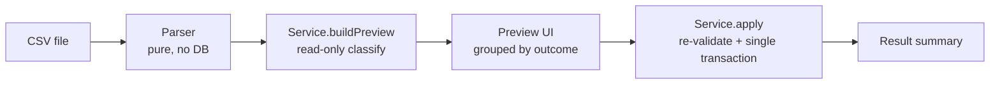
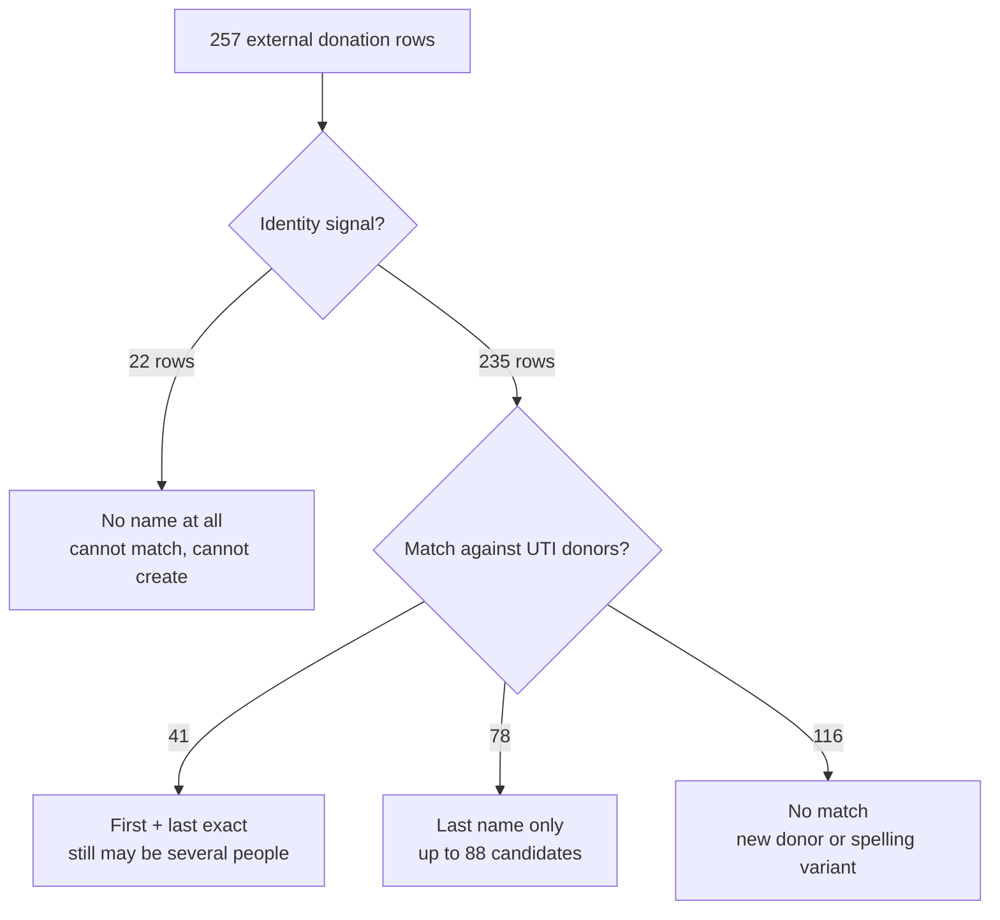

# Hand-off: External Donation Import (OJC / Zelle / Website / Donors Fund)

**Written:** Aug 4, 2026
**Repo:** `/Users/stevenhertz/Downloads/TestDonorClass2`
**Purpose:** Paste this into a new thread to continue where we left off. Everything in Part 1 is
already built and merged. Part 2 is the new work that has *not* been started — it is blocked on the
questions in Part 4.

---

## Part 1 — What is already built (done, do not redo)

Two NCOA import flows are complete, tested, and reachable from **Settings → Address Updates**.

| Flow | Input file | What it does | Screen |
| --- | --- | --- | --- |
| NCOA Update | `Chai_Olam_NCOAUPD.csv` | Replaces a donor's address with the USPS forwarding address, snapshotting the old one | `NCOAImportView` |
| NCOA Delete | `Chai_Olam_NCOADEL.csv` | Flags the donor `badAddress` (address left untouched) | `NCOADeletionImportView` |

### Architecture pattern to copy

Both flows use the same shape, and the external-donation import in Part 2 should follow it:



Key invariants worth preserving in the new flow:

- **Preview never writes.** Classification is a pure read.
- **Apply re-validates.** Every record is re-checked against the live row before writing, so a record
  changed between preview and apply is skipped rather than clobbered.
- **One transaction.** `DonorRepository.updateBatch` wraps the whole apply so a mid-way failure
  leaves nothing half-applied.
- **Idempotent.** Re-running the same file is a no-op; already-applied rows classify as
  "already current" / "already flagged".
- **Wrong-file guard.** `NCOADeletionFileParser` refuses an update file and vice versa, surfacing
  `NCOAFileParserError.wrongFileType`.

### Supporting pieces already in place

| File | Role |
| --- | --- |
| `app source/types/PostalAddressNormalizer.swift` | Case/space/suffix-insensitive address comparison (AVE ≡ Avenue) |
| `app source/types/DonorMailStatus.swift` | `active`, `badAddress`, `doNotMail`, `deceased` |
| `app source/types/DonorAddress.swift` | Address value type + `matches()` |
| `app source/backbone/Services/DonorAddressUpdateService.swift` | Address swap + prior-address snapshot |
| `app source/backbone/Services/DonorMailStatusUpdateService.swift` | Mail-status flag policy (never downgrades a stronger suppression) |
| `app source/backbone/Repository/DonorRepository.swift` | `updateBatch` transactional bulk write |

Xcode note: the project uses `PBXFileSystemSynchronizedRootGroup`, so **new Swift files added to
disk are picked up automatically** — no manual "Add Files to Xcode" step is needed.

---

## Part 2 — The new problem: merging external donations

### The business situation (in Steven's words, restated)

Not every donation arrives as a check that gets keyed into the app. Some arrive through OJC, some
through Zelle, some by credit card on the website, and some as grants from The Donors Fund. Those
generate an email or a report rather than a record in the app, and they have to be merged in. The
donor may already exist in the app, or may be brand new — in which case the donor has to be created
along with the donation.

### The file

`/Users/stevenhertz/Documents/Claude/Projects/Manage my work/united_tiberius_donations_unified.csv`

257 data rows, 21 columns, **$9,682.01** total, dates **2021-02-17 → 2026-06-03**.

| Source | Rows |
| --- | --- |
| The Donors Fund | 85 |
| Website (Sola) | 73 |
| Zelle | 61 |
| OJC | 38 |

Rows are clustered, not evenly spread — 2021: 12, 2024: 26, 2025: 110, 2026: 109. So this file is a
backlog catch-up, not one month's activity.

### Column fill rates — this is the crux of the problem

| Column | Filled | Note |
| --- | --- | --- |
| Reference Number | 256/257 | 1 blank; these are per-source refs, not app transaction numbers |
| Source | 257/257 | |
| Date | 257/257 | `MM/DD/YYYY`, all parse cleanly |
| Gross Amount | 257/257 | all parse; $1.00 – $800.00 |
| First Name | 167/257 | |
| Last Name | 164/257 | |
| Organization/Company Name | 68/257 | 58 of these are Donors Fund |
| Street Address | 25/257 | |
| City | 60/257 | |
| State | **4/257** | |
| Zip | 52/257 | |
| Email | 63/257 | |
| Phone | 25/257 | |
| Memo/Notes | 33/257 | |
| Hebrew Name | 20/257 | |
| Mother's Hebrew Name | 19/257 | |
| Details | 9/257 | |
| Product | 25/257 | website only; 3 distinct offerings |
| Message ID | 25/257 | website only |
| Review Needed | 16/257 | pre-flagged by whoever assembled the file |

Only **60 of 257** rows carry any address component at all. 22 rows have no usable identity
(no first name, no last name, no organization).

### Why this cannot be automated the way NCOA was

NCOA worked because every row carried a donor ID *and* a verifiable old address — the app could
prove it was touching the right record. Here that proof does not exist.



Concrete blockers found against `donations_uti.sqlite` (9,752 donors, 9,752 donations):

1. **No shared key.** 0 of the 256 reference numbers exist anywhere in the donations table, and
   `transaction_number` is empty on all 9,752 existing donations. There is no way to detect "this
   donation was already entered" by ID — only by fuzzy date + amount + donor.
2. **Email and phone are useless as matchers.** The existing donor table has **0 emails and 0
   phones** populated. The 63 emails in the CSV cannot be matched against anything.
3. **Name matching is genuinely ambiguous.** 41 rows match on first + last, 78 rows match on last
   name only — one last name returns up to **88 candidate donors**. 116 rows match nothing.
4. **Address can rarely break the tie.** 9,720 donors have addresses, but only 60 CSV rows do.
5. **Donors Fund rows are organizations, not people.** 58 rows carry a company name where the human
   donor may or may not be named.

**Conclusion:** this needs a human-in-the-loop reconciliation screen, not a silent importer. The
right build is a triage queue that proposes a match, ranks candidates, and requires a decision on
anything ambiguous — with the same preview/apply/transaction discipline as the NCOA flows.

---

## Part 3 — Proposed shape (not yet agreed, for discussion)

A per-row triage decision, each row landing in one of five buckets:

| Bucket | Meaning | Action on apply |
| --- | --- | --- |
| Confident match | one candidate, corroborated by address or exact name | attach donation to existing donor |
| Needs choice | 2+ plausible candidates | user picks from a ranked list |
| New donor | no match, identity sufficient to create | create donor + donation |
| Insufficient identity | no name/org | park in an unidentified-donations holding area |
| Suspected duplicate | same donor + date + amount already in app | skip, with an override |

Open design points: how the "already imported" ledger is stored so a re-run of the same file is a
no-op (probably a new table keyed on `source` + `reference_number`), and whether Donors Fund rows
create an organization donor or a person donor.

---

## Part 4 — Open questions (blocking; these are what I asked)

1. **When you genuinely cannot identify the donor, what do you do today?** Do you enter the donation
   under an "Anonymous" or "Unidentified" donor, leave it out of the app entirely, or hold it
   somewhere until you figure it out? This determines whether the app needs a holding area or just
   a skip.

2. **For Donors Fund grants, who is the donor of record?** The fund itself (one donor record
   receiving many donations), or the individual behind the grant (58 rows have a company name and
   may or may not name a person)? This decides whether organization donors are a first-class concept.

3. **How do you want duplicates judged?** If a donor already has a donation on the same date for the
   same amount, is that automatically the same gift (skip), or does that legitimately happen twice?

4. **Does the 22-row no-identity group have a paper trail elsewhere** (a bank statement, an OJC
   report) that could be looked up, or are those permanently anonymous?

5. **Is `Review Needed` (16 rows) authoritative?** Should the importer trust that flag and force
   those into manual review regardless of how good the automatic match looks?

---

## Part 5 — Wave processing (the recurring future state)

Steven flagged that this should not be a one-time import. The 257-row file is a backlog; going
forward these external donations will keep arriving and need to be merged on a cadence.

Things to settle for the recurring design:

| Question | Why it matters |
| --- | --- |
| What cadence — weekly, monthly, ad hoc when the email arrives? | Determines whether a wave is a scheduled job or a manual "start new wave" button |
| Is each wave one combined file, or one file per source? | Per-source files let the parser be strict; a combined file needs a `Source` column contract |
| Should a wave be resumable? | 257 rows of triage is more than one sitting — waves likely need saved partial progress |
| Do earlier decisions teach later waves? | e.g. "Zelle name X is always donor #1234" as a remembered alias, so wave 2 is faster than wave 1 |
| Who reviews, and does it need an audit trail? | Whether each decision records who made it and when |

My recommendation is to model a **Wave** as a first-class record (file name, imported date, row
count, decisions made, applied-at timestamp) so that the backlog file becomes "Wave 1" and every
future file is the same mechanism rather than a special case. The alias/decision memory in row 4
above is what makes wave N cheaper than wave 1, and is the highest-value part to design early.

---

## Part 6 — Useful paths and commands

```
Repo:            /Users/stevenhertz/Downloads/TestDonorClass2
New CSV:         /Users/stevenhertz/Documents/Claude/Projects/Manage my work/united_tiberius_donations_unified.csv
NCOA files:      /Users/stevenhertz/Downloads/CO Updates/Chai_Olam_NCOAUPD.csv
                 /Users/stevenhertz/Downloads/CO Updates/Chai_Olam_NCOADEL.csv
Databases:       TestDonorClass2/donations_co.sqlite, donations_db.sqlite
                 donations_uti.sqlite  (the 9,752-donor set used for match analysis)
Existing import code:  TestDonorClass2/app source/screens/NCOAImport/
                       TestDonorClass2/app source/backbone/Services/NCOA*.swift
```

Prior thread transcript, if deeper history is needed:
`~/.cursor/projects/Users-stevenhertz-Downloads-TestDonorClass2/agent-transcripts/1e6101ac-3d8e-4ea7-b5f1-c520473ec5ba/1e6101ac-3d8e-4ea7-b5f1-c520473ec5ba.jsonl`

---

## Suggested opening message for the new thread

> Read `HANDOFF-external-donation-import.md` at the repo root. The NCOA update and delete imports in
> Part 1 are done. I want to work on Part 2 — merging the external donations file. Here are my
> answers to your Part 4 questions: …
